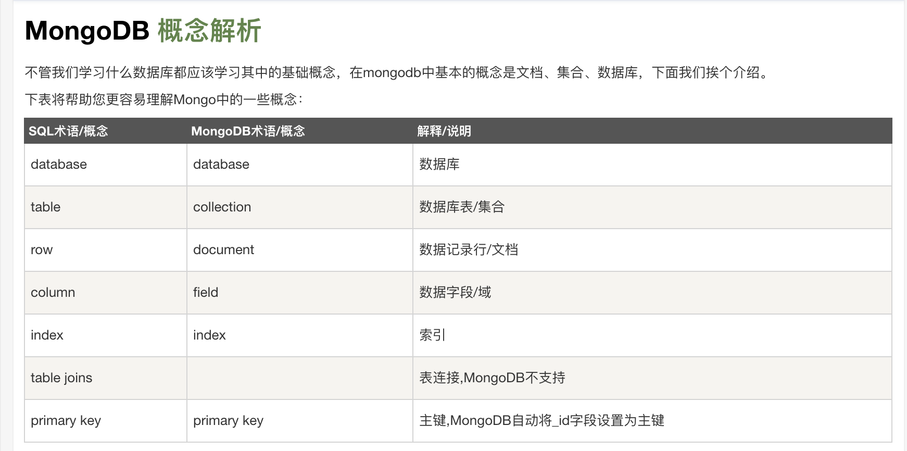

1、官网、驱动、安装、连接、可视化工具

---------------------------------------------------------------------------------------------------------------------
https://www.runoob.com/mongodb/mongodb-java.html
https://mongodb.github.io/mongo-java-driver/3.10/driver/getting-started/quick-start/

---------------------------------------------------------------------------------------------------------------------
官网、驱动、安装、连接、可视化工具

https://www.mongodb.com/
https://www.mongodb.com/cn
https://docs.mongodb.com/
https://docs.mongodb.com/manual/
https://docs.mongodb.com/manual/reference/method/sh.shardCollection/
中文社区
http://www.mongoing.com/docs/reference/command/shardCollection.html

linux版本下载：https://www.mongodb.org/dl/linux
windows版本下载：https://www.mongodb.org/dl/win32
此页面也可以：https://www.mongodb.com/download-center/community 选择相应版本和系统 进行下载，不过版本不全

驱动
https://mongodb.github.io/mongo-java-driver/
https://github.com/mongodb/mongo-java-driver
https://github.com/mongodb/mongo-python-driver
https://github.com/mongodb/mongo-go-driver

可视化工具
https://nosqlbooster.com/
https://studio3t.com/

MongoDB可视化工具Studio 3T的使用
https://blog.csdn.net/weixin_39999535/article/details/81383196

安装
export PATH=/Users/yangzl/mysoft/mongodb-osx-x86_64-4.0.10/bin:$PATH

如果你的数据库目录不是/data/db，可以通过 --dbpath 来指定。
mongod --dbpath=/Users/yangzl/mysoft/mongodb-osx-x86_64-4.0.10/data/db

默认port=27017 dbpath=/data/db

或者
brew install mongodb

启动，-f是--config的缩写
mongod  -f ${HOME}/mongodb/conf/node3/mongo_conf.conf 
mongod  -f ${HOME}/mongodb/conf/node3/mongo_db.conf 
mongos  -f ${HOME}/mongodb/conf/node3/mongo_route.conf 

mongod --config /etc/mongod.conf

以repair 模式启动
mongod -f /etc/mongod.conf --repair

停止进程
mongod  -f ${HOME}/mongodb/conf/node3/mongo_conf.conf --shutdown
mongod  -f ${HOME}/mongodb/conf/node3/mongo_db.conf --shutdown

mongod --config /etc/mongod.conf --shutdown

kill进程

PROCESS_NAME="${HOME}/mongodb/conf/node3/mongo_route.conf"
CUR_USER=`whoami`
ps -ef|grep $PROCESS_NAME |grep ${CUR_USER} | grep -v grep | awk '{print $2}' |while read pid
do
        kill -9 ${pid} 2>&1 >/dev/null
        echo "进程名称:${PROCESS_NAME},PID:${pid} 成功停止"
done

mongodb命令.md
连接

客户端shell连接：
cd /Users/yangzl/mysoft/mongodb-osx-x86_64-4.0.10/bin
./mongo
默认连接到connecting to: mongodb://127.0.0.1:27017/?gssapiServiceName=mongodb
或者
mongo 20.26.37.176:38200/esb
mongo 20.26.37.177:38201/esb
mongo 20.26.37.178:38202/esb

#使用默认端口27017登陆MongoDB
mongo 127.0.0.1

mongo --help

#使用exit，回车则退出交互环境

命令：
show dbs 显示所有数据的列表
执行 "db" 命令可以显示当前数据库对象或集合。

查看数据库
> show dbs

运行"use"命令，可以连接到一个指定的数据库。
> use local

>使用指定库
> use wiki

查看所有数据集
> show collections

查询集合
db.getCollection("AOP_ABILITY_BASEINFO")

db.AOP_ABILITY_BASEINFO.find().count();
db.AOP_ABILITY_BASEINFO.find({key1:value1, key2:value2}).pretty()

---------------------------------------------------------------------------------------------------------------------

https://www.cnblogs.com/zhoujinyi/p/4668218.html
https://docs.mongodb.com/manual/reference/method/sh.shardCollection/

shell命令
1) 分片的配置和查看

① 添加分片：sh.addShard("IP:Port") 
② 开启分片功能：sh.enableSharding("库名")、sh.shardCollection("库名.集合名",{"key":1})
  sh.shardCollection("<database>.<collection>", { <shard key> : "hashed" } )
③ 查看分片状态：sh.status()

---------------------------------------------------------------------------------------------------------------------

